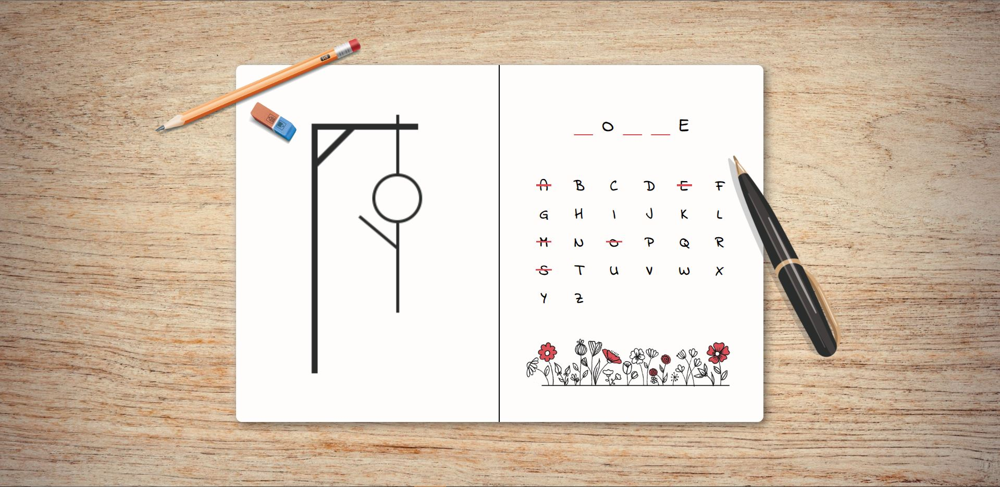

# Hangman Game

## Table of contents

- [Overview](#overview)
  - [Features](#features)
  - [Screenshots](#screenshots)
  - [Link](#link)
- [My process](#my-process)
  - [Built with](#built-with)
  - [What I learned](#what-i-learned)

## Overview
The goal of this project was to create an engaging and responsive Hangman game. The core functionality revolves around allowing users to guess a word letter-by-letter. With each incorrect guess, a part of the hangman figure appears. 
The game has been designed to adapt seamlessly across various screen sizes, ensuring an optimal experience regardless of device.

### Features

1.	Dynamic Word Generation: When the player clicks the start button, a word is randomly chosen for them to guess.
2.	Guessing the Word: Players guess the word using dedicated alphabet buttons. Once a button is selected, it becomes disabled and is crossed out in red.
3.	Real-time Feedback:
    - Correct Guesses: Letters guessed correctly are immediately revealed in their respective positions.
    - Incorrect Guesses: Wrong guesses incrementally reveal parts of the hangman drawing.
4.	Endgame Scenarios:
    - Loss: After six incorrect guesses, the hangman is fully revealed, and the hidden word is shown in red, accompanied by a matching loss message.
    - Victory: A successfully guessed word is highlighted in green, followed by a win message.
5.	Option to Play Again: Players have the opportunity to start a new game by clicking the "Play again" button, which generates a new word and resets the game.

### Screenshots

### Link

- Live Site URL: https://hangman-game-pk.netlify.app/

## My process

The Hangman game was a part of "The Modern React Bootcamp" by Colt Steele on Udemy. Instead of strictly adhering to the course's guidance, which used class components, I utilized functional components and React hooks to build the game.

The design I chose reminds me of playing Hangman traditionally - with a notebook and pen. The background mimics a desk, with the main container looking like a notebook page. To enhance the theme, I included elements like a pencil, pen, and eraser. I chose a few accent colors to keep the design clean and simple.
I adopted a mobile-first design, and using CSS, incorporated layout techniques like Grid and Flexbox.
To ensure the design adapted well to different screen sizes, I used CSS custom properties and media queries, adjusting the layout and fonts as needed.

The game's dynamic features were achieved using React:

- **State Management:** With useState hooks, I managed various game states, such as the initiation, game's progression, and conclusion.

- **User Interactions:** Functions like **handleGuessedLetter** and **handleStartGame** were set up to track player inputs. Guessed letters were added to an array, and each incorrect guess updated the hangman drawing.

- **Game Outcome:** Using a **useEffect** hook, I checked for the number of incorrect guesses or if the word was completely guessed, directing the game to its end phase when needed.

- **Restart Feature:** The **handlePlayAgain** function was incorporated to reset the game, allowing players to start a new game.

- **Component Structure:** Components such as **StartPage**, **Hangman**, **WordDisplay**, and **AlphabetButtons** made the design modular and the code more readable.

- **UI Dynamics:** Conditional rendering enabled smooth transitions between different game states, providing a consistent user experience.

### Built with

- Semantic HTML5 markup
- CSS custom properties
- Flexbox
- CSS Grid
- Mobile-first workflow
- React

### What I learned

The Hangman project was a significant learning step for me. Using functional components instead of class components, I gained a clearer understanding of how React hooks work. The different states like **startGame**, **gameOver**, and **guessedLetters** showed me the importance of keeping track of the game's progress. I also got the hang of using **useEffect** to react to changes in the game's condition, such as the number of incorrect guesses. Through functions like **handleStartGame** and **handleGuessedLetter**, I learned to manage how the game responds to player actions. Additionally, deciding what components like **StartPage** or the main game should display based on the game's state taught me about the dynamic nature of React. All in all, this project made me more comfortable with using React to manage complex interactions and game logic.
